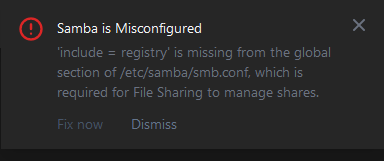

# Setting up Proxmox NAS

You can set up a NAS easily on Proxmox utilising a TrueNAS vm and I have done so before. The downside to this is that you're dedicating a whole vm's worth of resources for just sharing your files. Also many apps or services don't work very well with only network shares. In this document I will cover how I have set up my NAS on Proxmox with much lighter option using Cockpit in an LXC.

## Creating a ZFS pool


Make sure you have at least two empty and same sized disks for this task. Under your Proxmox node navigate to Disks->ZFS and choose Create: ZFS.

There you should give a name for your ZFS pool, select the disks and RAID level you want to use and press Create. Here I only have two disks available so I will use Mirror as my RAID level.


Now we have a ZFS pool to store things on. Proxmox reports that the pool can be used to store containers and disk images, which is what we are going to do next.

## Creating a Container for managing shares

Right now we only have a place to store files but nothing to manage or share them. For that we need a container so let's create one.

Go to your Proxmox local storage, named local(nodename) in the sidepanel, and choose **CT Templates** and **Templates**. For now we are going to use Debian 12 as the container OS because that's what Proxmox is running on.


Select **debian-12-standard** from the list and press Download. Wait for the download to finish.


Now we can create a new container from the template so let's do that. From the upper right corner click **Create CT**. On the first page fill in the hostname for the container and a password. This container doesn't need root access to the underlying OS so we can leave **Unpriviliged container** checked. Make sure **Nesting** is also checked.


On the next page choose the just downloaded Debian 12 template from the dropdown list.


On the Disks page we choose where the container OS is stored. If you have SSD storage on your server then using that is preferrable. The OS won't need much storage because it is using the kernel and it's modules from Proxmox itself. So the default 8GiB should be fine.


Next we allocate CPU and Memory resources for the container. Containers only use what they need and they don't count shared resources from Proxmox in the usage. That's why they are much lighter on resources than vms, which reserve them for their own use even when they don't use all of them. 

So if we allocate for example 4 cores and 8GiB RAM for the container, it'll only use maybe 1 core and 256MiB most of the time. But because we have set the limits much higher, the container can use more resources during bursts eg. tasks done by apps. After that the resources are released and can be used by other containers etc.

That said we don't need high limits for our fileshare container, 2 cores and 1GiB should be more than enough.


On the Network page we can assign a static IP address for the container or choose to use one provided by DHCP. Debian containers may sometimes encounter a bug when setting IPv6 as DHCP so make sure to set it as static. The bug will prevent the container from entering the console and it will make the container unusable. You can also leave the IPv6 as static and empty, that way it won't be used at all. DNS settings can be left default which is to use host settings.


Check that the settings are correct on the last page and then click Finish. Wait for the creation task to be done and then close the output window.

## Adding ZFS pool to the container

Right now the container only has storage allocated for storing its OS. We can add the ZFS pool created earlier as a mount point on the container so we'll more storage to use for the shares.

Clicking on the container from the left sidebar we can access its **Resources**. Under there we can see every resource allocated to the container and edit them. Since we haven't started the container yet we can add the mount point. If you have the container already running consider shutting it down since adding a mount point can give an error then.
 


From the topbar we can select **Add** and then **Mount Point**. Storage should be set to the ZFS pool we created and size can be the whole pool or less. Size is again just a max limit the container can use, just like with the other resources it has. In the Path we need to specify where to mount the storage pool in the container. Usually the best way to do this set the path as ```/mnt/<storagename>``` where "storagename" is the name of your storage. When finished, click Create.


## Installing Cockpit to manage shares

The container is now ready to get up and running. Start the container so we can start managing it. Open up the container and go to it's console. In the login screen the username is **root** and password is the one we set up in the container creation screen.


After logging in we should make sure that the container is up-to-date. We can do that by running the command 

```
apt update && apt upgrade
```

and pressing *Enter* when asked to continue.

At this point we could go and install Cockpit for managing the container, but at the time of writing the version from the Debian *stable* repo is already quite old. Luckily there is a newer version in the *backports* repo which can be used (287 -> 309). We can add the *backports* repo by changing the apt sources list with the command

```
nano /etc/apt/sources.list
```

and adding the line

```
deb http://deb.debian.org/debian bullseye-backports main contrib
```

at the end of the document. Press **CTRL + X**, **Y** and **Enter** to exit and save.


Now we can install the newer version of Cockpit. Installing Cockpit will however also try to install some recommended packages which we don't need as they are already covered by Proxmox. So to install Cockpit from the backports repo and without dependencies we need to use command:

```
apt install -t bookworm-backports cockpit --no-install-recommends
```

Cockpit doesn't allow login as root by default and that prevents us from changing some settings that we want to change. So let's allow root login in Cockpit:

```
nano /etc/cockpit/disallowed-users
```

In here we can see *root* listed as a disallowed user. Delete it from here and save the file. That's it.

To make it easier to manage network shares we are also installing three plugins for Cockpit:

- https://github.com/45Drives/cockpit-file-sharing for managing Samba and NFS shares
- https://github.com/45Drives/cockpit-identities for user and group management
- https://github.com/45Drives/cockpit-navigator for browsing the file system from Cockpit

These plugins aren't available from Debian repos but we can install them using the .deb files found on their GitHub releases. To do this we can run the following commands:

```
# Make a directory to temporarily save the downloaded files
mkdir 45drives
# Change working directory
cd 45drives
# Download File Sharing plugin
wget https://github.com/45Drives/cockpit-file-sharing/releases/download/v3.3.4/cockpit-file-sharing_3.3.4-1focal_all.deb
# Download Navigator plugin
wget https://github.com/45Drives/cockpit-navigator/releases/download/v0.5.10/cockpit-navigator_0.5.10-1focal_all.deb
# Download Identities plugin
wget https://github.com/45Drives/cockpit-identities/releases/download/v0.1.12/cockpit-identities_0.1.12-1focal_all.deb
# Install all plugins with one command
apt install ./*.deb
# Remove the .deb files as they are no longer needed
rm *.deb
```

Now we should be able to access Cockpit as root and have all the necessary plugins installed.

## Managing the shares

Let's access the Cockpit UI by typing in the URL of <containerip:9090>. Login info is the same as for the container. If everything went okay this far then you will see Cockpit UI and on the left sidebar you should have also the added plugins.


From the left sidebar select *Navigator* and find the place where we mounted the ZFS pool. In my case it was ```/mnt/tbpool```. If you can see your pool mounted here, then we can continue setting up the fileshares. If not, then double check the mount point.


Next we want to setup a group that we can add users to who will have access to the shares. For that we will use the plugin **Identities** from the left sidebar. Click on *Groups* after opening *Identities*. At the top of the groups list there is a '+'-button, click it. Fill in the name for the group and click *Create*.


Get back to the *Identities* and this time select **Users** and **New User**. Fill in the username of your choice and in the *Groups* section add in the group we just created. Click *Apply* and enter a password for the user, then click *Apply*. After that the user is now created.


For the file shares we are going to use Samba and it needs a different password than the one we just set. So on the created user page navigate down to *Credentials* and select **Set Samba Password**. You can set the same password or a different one. Just remember that if they differ then the earlier one is for Linux/Container login and the latter is for Samba only.

Now if we click on *File Sharing* from the sidebar we can start managing the shares. On the first load of the page there will be a warning on the upper right corner of the screen saying that 'Samba is Misconfigured'. This is expected behavior. We have logged in as root so we can just click **Fix now** to configure Samba automatically.



After that we can finally configure the share itself. Under **Shares** you can start adding a new share with the '+'-button on the top. Give a name for your share and add the path of the mount point, which is ```/mnt/tbpool``` in my case. Next select the group you created under the **Valid Groups**. Final step is to set how the permissions are handled on the share. Most of the time *Windows ACLs* is the best option here so set that on. Click *Confirm* and we are good to go!


If for some reason you can't access the share from other computers or can't write to it, check the shares permissions. To do so, go to *Cockpit* -> *File Sharing* -> *Shares* and click on *Edit*. Under the Path there is a *Edit Permissions* -button, click on it. Make sure the permissions look something like the picture below and click apply.

