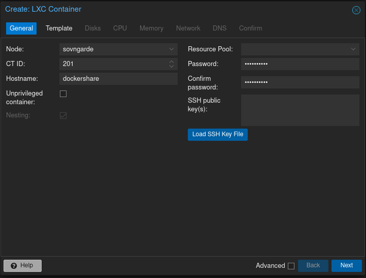
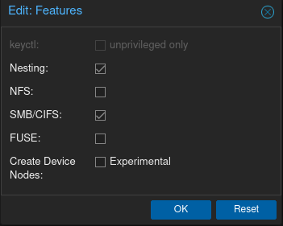

# The ultimate LXC with Docker and NAS

Earlier I had created two different containers for running Docker and NAS on Proxmox. These both are fine solutions and they could be used separately. However if there's need and will to have Docker use the same ZFS pools for storage, there will be a hassle. Though there are tutorials for accomplishing that, I myself will try another route. So in this document I will explore if I can combine the two LXCs to one and create a monster that is the "Ultimate DOCKER/NAS LXC"™. Disclaimer: this is not the smartest or the most secure way of doing this. But it's used in my Homelab which can be only accessed within my own home, so I can deem it safe enough for my use case.

## Creating the container

First we will create the container which we will be running Docker and NAS on. Make sure you have also created ZFS pools for the container to use as I have beforehand.
Let's click **Create CT** from the upper right corner. Enter the hostname and the password for the container. Then make sure to uncheck **Unpriviliged container**, after that **Nesting** should be greyed out and checked. 

On the next page choose the template you want to use, in this case I'd recommend using Debian because it will share the host kernel. Next page you can leave the disk size as default, much won't be stored on the root disk.

Next set the CPU cores and Memory you want the container be able to use. In my case I will set the container to have 4 cores, 8192 MiB memory and 1024 MiB swap. Remember that the container will only use the available resources if it needs them so it doesn't hurt to set them a bit higher. Especially if like me you will use the container for testing all kinds of Docker apps.

On the Network tab you can assign a static IP address for the container or just use the DHCP to dynamically assign it. On DNS settings it's usually best to use host settings. On the last page click **Finish** and the container will be created. Do not start the container yet. We will next change the containers settings by navigating to the newly created container and **Options**. Click on **Features** then **Edit** and make sure **Nesting** and **SMB/CIFS** are both checked.

